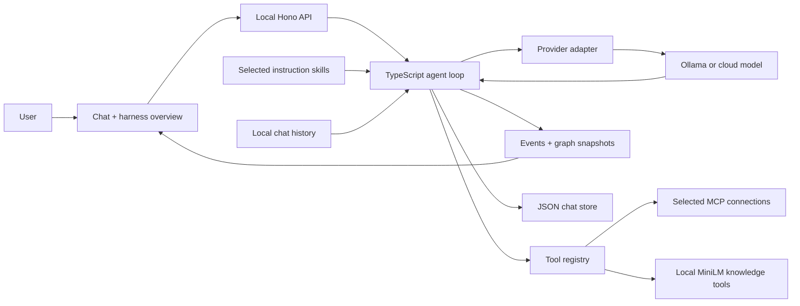

# Architecture

`src/server/agent.ts` assembles instructions/history, discovers tools, calls the model and executes tool requests over a bounded loop. `providers.ts` adapts Anthropic Messages and OpenAI-compatible streaming APIs. Ollama uses its compatibility endpoint. `mcp.ts` manages connections; `kb.ts` manages document ingestion and local retrieval. `src/shared/skills.ts` contains the skill registry and rejects unknown selections. `store.ts` persists chats and trace events.

A skill contributes instructions; a connection supplies tools; the model requests tools; the harness executes them. These roles are distinct and visible in the UI.

Events contain graph snapshots. The browser selects a snapshot for inspection; this is trace navigation, not re-execution. Chat history includes text messages and prior traces; it is not a durable checkpoint of all provider/tool state.
