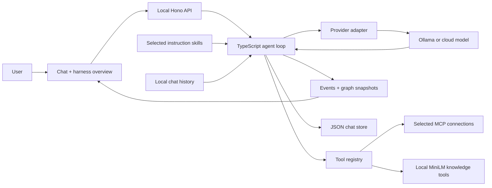

# Architecture

`src/server/agent.ts` assembles instructions/history, discovers tools, calls the model and executes tool requests over a bounded loop. `providers.ts` adapts Anthropic Messages and OpenAI-compatible streaming APIs. Ollama uses its compatibility endpoint. `mcp.ts` manages connections; `kb.ts` manages document ingestion and local retrieval. `src/shared/skills.ts` contains the skill registry and rejects unknown selections. `store.ts` persists chats and trace events.

A skill contributes instructions; a connection supplies tools; the model requests tools; the harness executes them. These roles are distinct and visible in the UI.

Events contain graph snapshots. The browser selects a snapshot for inspection; this is trace navigation, not re-execution. Chat history includes text messages and prior traces; it is not a durable checkpoint of all provider/tool state.

## Observable layers

- `src/server/trace.ts`: request-scoped tracing with AsyncLocalStorage; actual provider/MCP fetch instrumentation and correlated tool operations. HTTP metadata is redacted before emission.
- `src/web/network.ts`: browser-to-local-API request/response/body events. Run IDs propagate through the API.
- `src/web/TraceConsole.tsx`: chronological combined console, category/source filters and event inspector. Legacy `parent` lanes render as **User App**.
- `src/web/SettingsDialog.tsx`: native modal dialog with model, skills, connections and runtime sections, plus MCP discovery checks.
- `src/server/kb.ts`: parser/embedding/store/retrieval events expose the actual local MiniLM vector pipeline.

A tool operation receives a correlation ID; child HTTP calls point to the initiating operation. A request records separate start, headers and consumed-body completion events. No remote server internals are inferred. A local MCP fixture in `scripts/demo-mcp.mjs` makes discovery and execution reproducible without external packages or keys.
