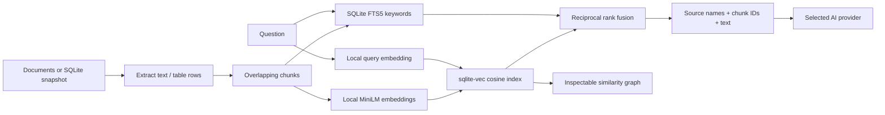

# Follow a request under the hood

Understanding AI is an instrumented agent harness you can run locally. It shows its own real execution; it does not reveal ChatGPT's private implementation or unreported model internals.

## Start here

1. Run `./setup.sh setup` with Node 24+ and pnpm.
2. Open Settings → Model. Load your Ollama models, or supply a cloud-provider key for this page session.
3. Open Data → Load company policies. This creates and imports a synthetic SQLite database.
4. Test retrieval with “What is the learning budget?” Inspect the top source chunk and graph.
5. Ask the same question in chat. Select rows in All to inspect inputs, results, correlation IDs and timing.
6. To see model-selected tool execution, use a tool-capable model such as an installed Qwen model, enable the bundled local demo MCP in Connections, and ask it to add 17 and 25 using its tool.

Ollama capability detection chooses the path below. Models without tool support use harness-driven retrieval. They do not choose MCP tools. Other providers use their advertised tool APIs; model-specific support can still vary.

```mermaid
sequenceDiagram
  participant U as User App
  participant A as Agent harness
  participant K as SQLite knowledge
  participant P as AI provider
  participant M as MCP server
  U->>A: POST /api/chat + session settings
  A->>A: Resolve skills and model capabilities
  alt Model supports tools
    A->>M: Connect and discover tools
    M-->>A: Tool schemas
    A->>P: Instructions + conversation + tool schemas
    P-->>A: Tool request
    A->>A: Match tool to advertised registry
    alt Knowledge tool
      A->>K: Search/read/table
      K-->>A: Source chunks
    else MCP tool
      A->>M: tools/call
      M-->>A: Tool result
    end
    A->>P: Append tool results; next model round
  else No tool support
    A->>K: Harness retrieves relevant chunks
    K-->>A: Source chunks
    A->>P: Conversation + retrieved context, no tool schemas
  end
  P-->>A: Stream text
  A-->>U: Forward text via SSE
  A->>A: Save successful chat and server trace
```

## Data and RAG



Storage is `data/kb/knowledge.sqlite`; originals remain in `data/kb/uploads`. Vectors are 384-dimensional. Rank fusion combines semantic and keyword ranks using `1 / (60 + rank)` for each list. The graph has up to 100 actual chunks with measured similarity edges; circular positions are not a dimensionality reduction. This is hybrid RAG, not GraphRAG. See the project README for import limits and migration behavior.

## Read the console

| Tab | What it shows |
| --- | --- |
| All | Time-ordered observed events across layers |
| User App | User message received by the harness |
| Network | Browser/API and instrumented provider/MCP HTTP request lifecycle |
| Agent | Settings, skills, prompt assembly, model rounds, metrics and stop/failure decisions |
| Tools | MCP connection/discovery and execution operations |
| Knowledge | Extraction, embedding, SQLite writes and hybrid retrieval |

Call types are **AI provider**, **external**, or **local**. A local Ollama HTTP request is still an AI-provider call. A stdio MCP is a local process, not HTTP traffic. The external category covers observable remote MCP HTTP calls. Correlation IDs join request start, response headers and body completion; parent IDs link instrumented child operations where available. Timing uses a monotonic clock for measured operations. Browser and server event timestamps use wall clocks for display.

Click an event to inspect its payload and graph snapshot. Filter by endpoint/event text or call type. Disable Follow to inspect older events without automatic scrolling. Known credential fields are redacted, but document text and tool outputs are intentionally inspectable: use appropriate demo data when sharing traces.

## Performance metrics

The last-request panel distinguishes waiting, receiving/processing, quiet, complete and failed states.

- **Total:** browser-observed time from Send until the stream ends, including retrieval, tools and persistence.
- **Completed model calls:** sum of completed model-call durations. During an in-flight call this is not its current elapsed time; use Total and the latest stage.
- **First text:** first text delta latency for the first model call, when one exists. It excludes prior harness setup; thinking/tool deltas are not visible text.
- **Output tokens:** counts reported by the provider, summed across completed model rounds. They may include provider-counted tool/reasoning output.
- **Tokens/sec:** reported output tokens divided by completed model-call seconds, including initial wait. This is end-to-end provider throughput, not decoder-only generation speed.

No token count is guessed from characters. Missing usage displays unavailable. Individual `Model request metrics` events include input/output counts, first-output and first-text latency, and duration. Partial/failed calls do not contribute to completed-call totals; the failure event records their elapsed time.

## Failure behavior and boundaries

After 15 seconds without a received event or text delta, the panel reports no recent activity; this is a warning, not proof that the model is dead. Local model loading can be slow. Each model HTTP call has a 120-second deadline, including streaming. Provider error events and streams missing their completion marker fail explicitly. A browser stream ending without a terminal frame also fails. Partial text remains visible with the request failure banner; empty placeholder responses are removed.

This is not a global run deadline: multiple model rounds and tools can extend the total duration. MCP initialization has its own timeout. There is no user cancellation/resume control yet. Successful server traces persist with chat history; failed-run traces and browser/upload/search events are currently session-only. The request-performance panel describes the current page's last submitted request, not a replayed historical run.

The harness cannot observe HTTP calls inside an MCP subprocess or remote server, provider-internal queueing/GPU work, or hidden reasoning. Embedding asset lifecycle events come from the embedding library and are not packet capture. A skill adds instructions; it neither grants permissions nor executes code.

## Verification

Run `pnpm typecheck`, `pnpm test`, and `pnpm build` from this project. Tests cover real local HTTP and stdio fixtures, credential redaction, SQLite transactions and retrieval, CSV/Excel parsing, capability detection, reported metrics, provider error frames and truncated streams. Live cloud-provider behavior requires your own credentials and is not covered by those local fixture tests.

## Fullscreen execution flow

Choose **Fullscreen flow** above the console. The diagram uses one chronological row per observed event and fixed lanes for User App, Agent, AI provider, Tools/MCP, Knowledge, and other HTTP traffic. This avoids crossing edges and does not infer causal relationships from proximity. Select an event to inspect payload, correlation ID and parent ID. Filter by event title or endpoint and adjust diagram width. The selected console event determines which run is shown; otherwise the latest run with a graph snapshot is shown. Escape or Close returns to the console. Elapsed labels are relative to the first displayed event (including when filtered).

## Execution guardrails

Tool execution is checked in `src/server/guardrails.ts`, immediately before dispatch in the agent loop. A model request is a proposal, not permission:

- Only known registered tool names can execute.
- Built-in `kb` search/list/read/table actions are read-only and allowed. The bundled, unmodified demo add/echo tools are allowed.
- Every other MCP tool is denied by default. In Connections, discover its tools and explicitly allow the specific tool. Grants persist with local settings until revoked; changing its endpoint, command, arguments or credentials clears grants in the UI. Enabling a server alone is insufficient.
- Tool arguments must pass JSON Schema validation and a 16,000-character limit. Invalid/unsupported schemas fail closed. No argument coercion is performed.
- A run can attempt at most 32 registered tool calls, in addition to the model-round limit. Denials return an error to the model and produce a visible guardrail event; denied actions are not dispatched.
- Browser requests from origins outside the configured local UI are rejected by the API.

Permissions come from user configuration, never prompts, retrieved documents, tool descriptions or MCP read-only annotations. Allowing a tool authorizes its capabilities, which may include writes, network access or code execution. There is no per-call approval queue or subprocess sandbox yet; only enable trusted servers. Server initialization/discovery itself can execute MCP code. This local API is not authenticated against other local processes and must not be exposed as a public multi-user service. This is an execution-permission boundary, not a general-purpose content moderation system or a guarantee against prompt injection.
